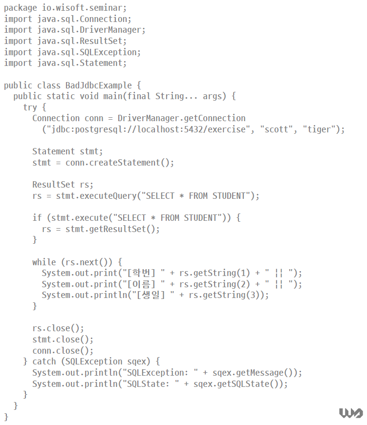

# JDBC를 처음으로 맛보았을 때의 프로젝트

# 찍어먹기 했던 JDBC 코드가 좋지않은 예제인 이유
## 1. 아이디, 비밀번호가 노출되어있다.

- 별도의 파일로 분리

## 2. 데이터베이스를 연결해서 Connection 객체를 만드는데 많은 비용이 든다.

- 모든 연결 요청이 있을 때마다 Connection 객체를 만들면 시간이 많이 걸린다.
- DBCP(Database Connection Pool)을 이용해서 일정량의 DB Connection 객체를 생성해서 Pool에 저장해둔다.
    - 연결 요청이 와서 필요할때마다 Pool에서 커넥션 객체를 가져다 쓰고, 반환한다.
    - 연결을 위한 Connection 객체를 생성하는 비용을 줄일 수 있다.

## 3. 정적 쿼리방식이다.

- 재사용이 불가능하다.
- SQL Injection 가능성이 있다.
- 동적 쿼리(PreparedStatement) 방식은 캐시를 사용해 재사용시 성능상 이점이 있다.

## 4. finally에 close()를 해야한다.

- 귀찮다면 try-with-resources 를 사용하자